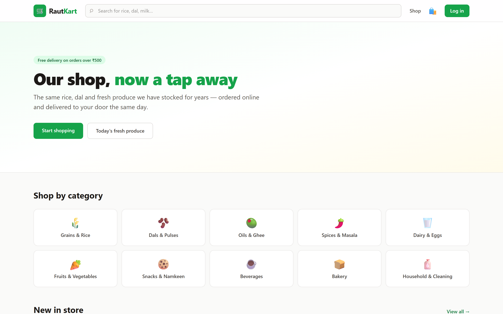
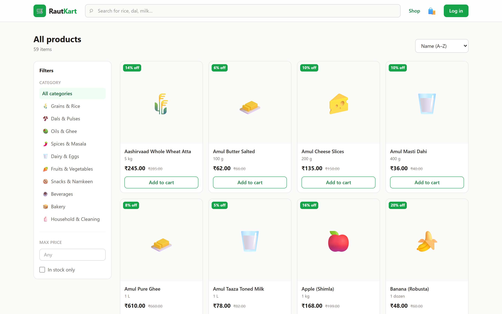
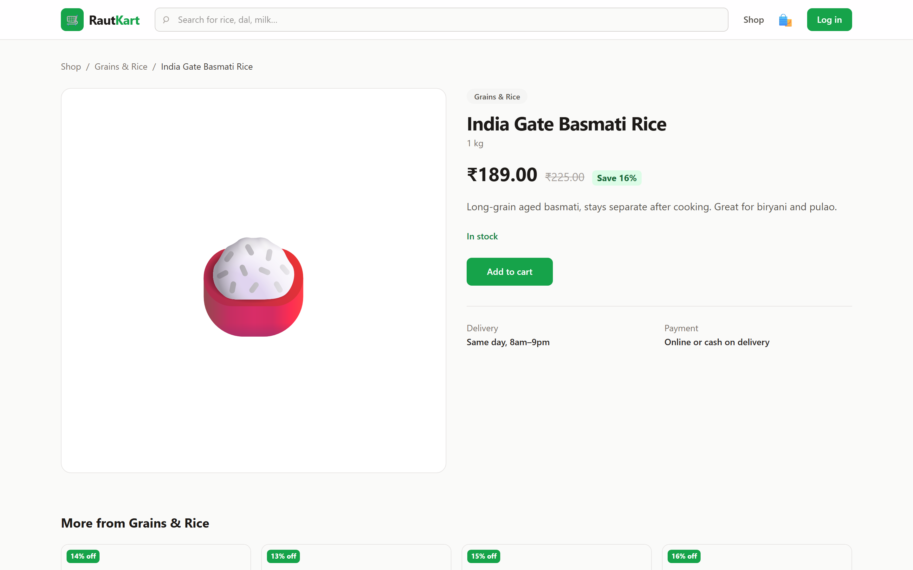
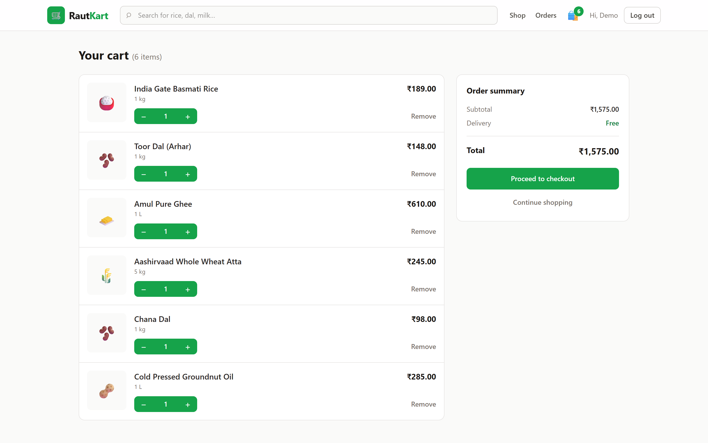
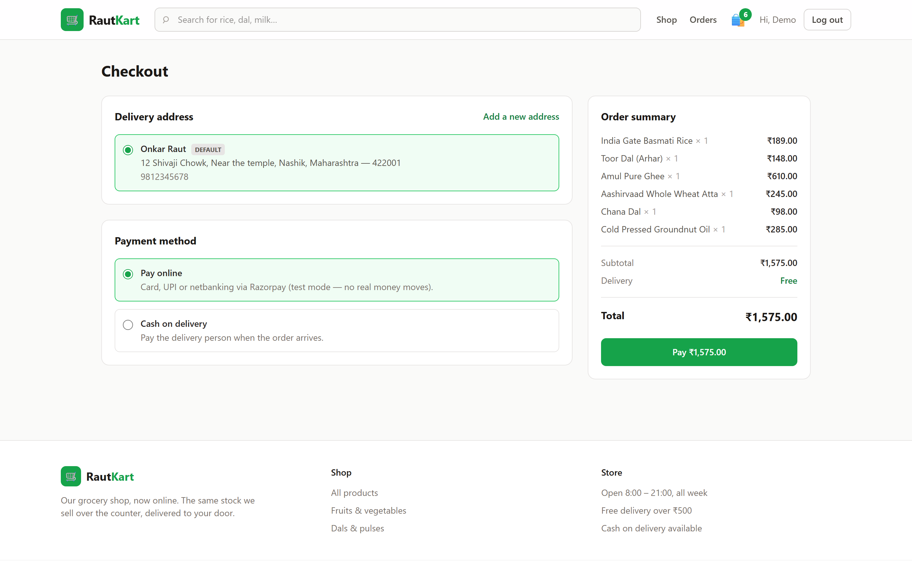
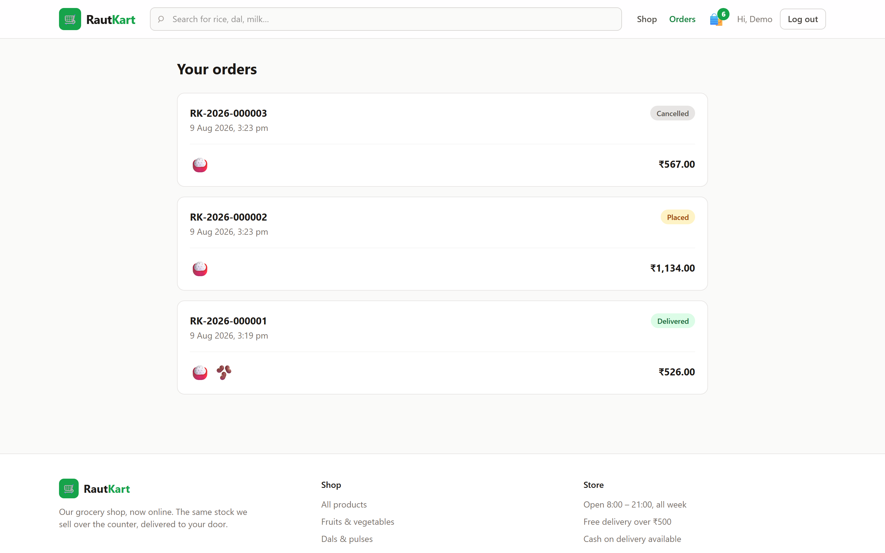
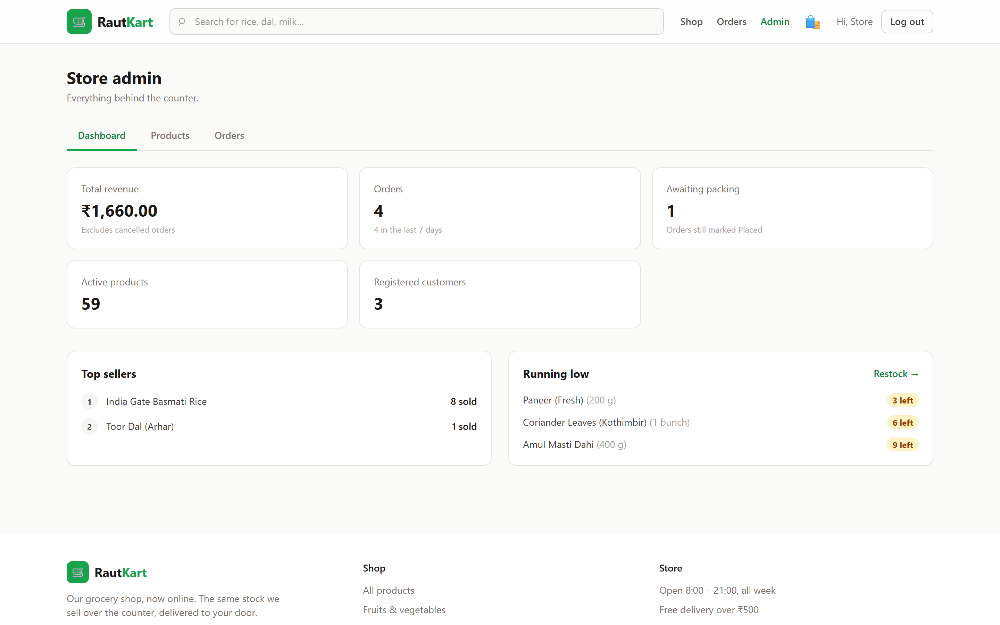
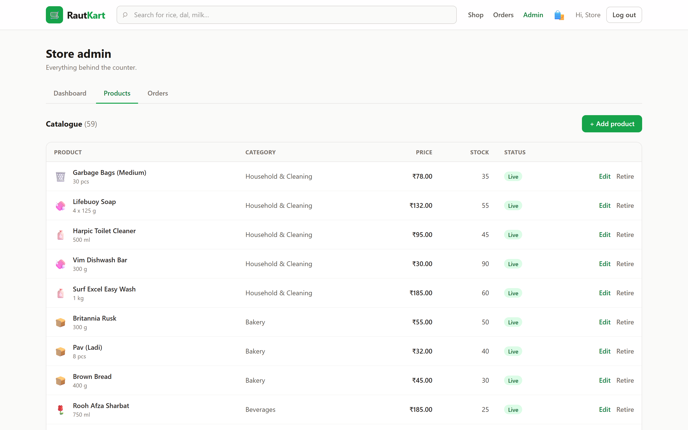
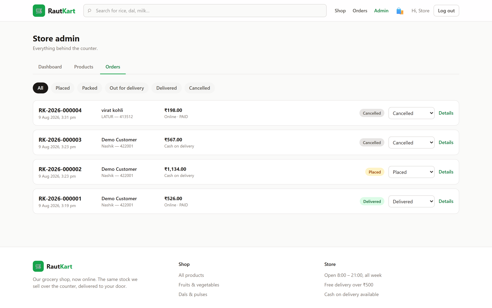
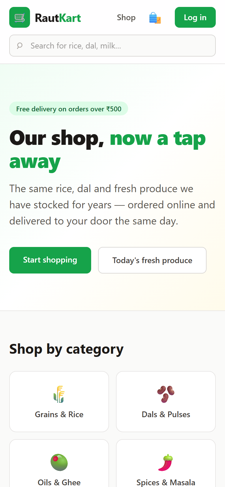

# RautKart

**An online storefront for my grocery shop.**

I run a grocery shop. This is what it would look like online — a full-stack build
with a React storefront, a Spring Boot API, PostgreSQL, and a real admin panel
for managing stock and orders.

[](https://github.com/onkarraut18/rautkart/actions/workflows/ci.yml)




---

## Why this project

Most portfolio e-commerce projects are built from a tutorial, so they end up
selling the same imaginary t-shirts. This one is stocked from my own shelves.

That shows up in the details:

- **The catalogue is real** — 59 products across 10 categories, with the prices
  and pack sizes I actually sell: toor dal by the kilo, ladi pav in eights,
  Amul ghee at ₹610 a litre.
- **The rules are real** — ₹30 delivery, free over ₹500, cash on delivery
  alongside online payment, because that is how people here actually pay.
- **The admin panel solves a problem I have** — knowing what is running low
  before a customer asks for it.

It is a portfolio project, not a live shop. Payments run in **Razorpay test
mode**; no real money moves.

---

## What it does

**For customers**

- Browse 10 categories, search, filter by price and availability, sort
- Product pages with live stock, discount against MRP, and related items
- A cart that lives on the server, so it survives a refresh and follows you to
  another device
- Checkout with a saved or new address, online payment or cash on delivery
- Order history with a delivery progress tracker, and cancel while it is still
  unpacked

**For the shop**

- Separate admin login — a customer token cannot reach the admin API
- Add, edit and retire products; stock managed inline
- Dashboard: revenue, orders this week, top sellers, and what is running low
- Move orders through Placed → Packed → Out for delivery → Delivered

---

## Screenshots

### Storefront

| Catalogue with filters | Product detail |
|---|---|
|  |  |

| Cart | Checkout |
|---|---|
|  |  |

Order history, with the status of each order:



### Admin panel

Revenue, top sellers, and a low-stock list that tells me what to reorder:



| Product management | Order management |
|---|---|
|  |  |

### On a phone



---

## Stack

| Layer | Choice | Why |
|---|---|---|
| Frontend | React 18, Vite, Tailwind CSS v4 | Fast dev loop, no CSS file sprawl |
| Backend | Java 17, Spring Boot 3.3 | Web, Data JPA, Security, Validation |
| Database | PostgreSQL 18 | Real constraints, real types, real money handling |
| Auth | JWT (JJWT) | Stateless; separate customer and admin logins |
| Payments | Razorpay Java SDK | Test mode, with a mock fallback |
| Tests | JUnit 5, MockMvc, Testcontainers | Integration tests against real PostgreSQL |
| CI | GitHub Actions | Backend tests and frontend build on every push |

---

## Architecture: thin client, thick backend

Business logic lives in Spring Boot. React renders what the API hands it and
recomputes nothing:

| The customer sees | Where it is calculated |
|---|---|
| Line totals, subtotal, delivery fee, grand total | `CartService` |
| "Add ₹204 more for free delivery" | `CartResponse.amountForFreeDelivery` |
| "16% off", "Only 3 left in stock" | `Mappers.toProduct` |
| Stock checks, order numbers, restock on cancel | `OrderService` |

The payoff is that a pricing rule changes in exactly one place, and the
storefront and admin panel cannot drift apart — neither of them knows the rule.

Two decisions worth calling out:

- **The order snapshots its address and prices.** It does not point at the
  customer's address row. When someone moves house, their old invoices must
  still say where those orders actually went.
- **Products are retired, never deleted.** Past orders reference them, and
  history should not develop holes.

---

## Running it locally

You need Java 17, Node 20+, PostgreSQL, and Docker if you want to run the tests.

**1. Create the database**

```sql
CREATE DATABASE rautkart;
```

**2. Start the backend**

```bash
cd backend
export DB_PASSWORD=your-postgres-password   # PowerShell: $env:DB_PASSWORD="..."
mvn spring-boot:run
```

Runs on <http://localhost:8080>. Hibernate creates the schema and the seeder
fills in 10 categories, 59 products and two demo accounts. It is idempotent —
restarting never duplicates anything.

**3. Start the frontend**

```bash
cd frontend
npm install
npm run dev
```

Open <http://localhost:5173>. Vite proxies `/api` to port 8080, so the browser
only ever talks to one origin.

### Demo accounts

| Role | Email | Password |
|---|---|---|
| Customer | `customer@rautkart.in` | `customer123` |
| Admin | `admin@rautkart.in` | `admin123` |

The admin panel is at `/admin`, via `/admin/login`.

### Configuration

Everything has a working default; override with environment variables.

| Variable | Default | Purpose |
|---|---|---|
| `DB_PASSWORD` | `postgres` | PostgreSQL password |
| `JWT_SECRET` | a dev value | Base64 256-bit HMAC key — **change for anything real** |
| `RAZORPAY_KEY_ID` | *(empty)* | Test key id; empty enables mock payments |
| `RAZORPAY_KEY_SECRET` | *(empty)* | Test key secret |

Store rules live in `application.properties`: `rautkart.delivery-fee` (₹30) and
`rautkart.free-delivery-above` (₹500).

---

## Tests

```bash
cd backend
mvn test          # needs Docker running
```

**35 integration tests**, run against a real PostgreSQL started by
Testcontainers — not H2. That matters: both of the significant bugs found during
the build were PostgreSQL-specific, and an in-memory stand-in would have passed
while hiding them.

| Suite | Covers |
|---|---|
| `AuthorizationTest` | Public vs protected routes, 401 vs 403, a customer token blocked from the admin API, signup cannot self-assign ADMIN |
| `CatalogApiTest` | Search, combined filters, LIKE wildcard escaping, server-derived fields |
| `CartAndCheckoutTest` | Totals, the delivery threshold on both sides, stock guard, checkout side effects |
| `OrderLifecycleTest` | Cancel restores stock, cannot cancel once packed, COD settles on delivery, one customer cannot read another's order |

CI runs the suite and the frontend build on every push.

---

## API

**Public**
```
POST   /api/auth/register        POST /api/auth/login      POST /api/auth/admin/login
GET    /api/categories
GET    /api/products?q=&category=&maxPrice=&inStockOnly=&sort=&page=&size=
GET    /api/products/featured    GET  /api/products/{slug}
```

**Customer** (JWT)
```
GET    /api/auth/me
GET    /api/cart                 POST /api/cart/items
PUT    /api/cart/items/{id}      DELETE /api/cart/items/{id}    DELETE /api/cart
GET    /api/addresses            POST /api/addresses
PUT    /api/addresses/{id}       DELETE /api/addresses/{id}
POST   /api/orders               POST /api/orders/payment/verify
GET    /api/orders               GET  /api/orders/{id}          POST /api/orders/{id}/cancel
```

**Admin** (JWT + `ROLE_ADMIN`)
```
GET    /api/admin/dashboard
GET    /api/admin/products       POST /api/admin/products
PUT    /api/admin/products/{id}  DELETE /api/admin/products/{id}   (soft delete)
POST   /api/admin/categories
GET    /api/admin/orders?status= PATCH /api/admin/orders/{id}/status
```

---

## Known gaps

Being straight about what is not done:

- Schema is managed by Hibernate `ddl-auto=update`. Real projects need Flyway
  migrations, and this one will get them.
- Order numbers use `count() + 1`, which is not safe under concurrent checkouts.
  A database sequence is the correct fix.
- No frontend tests yet.
- The Razorpay signature path is only exercised in mock mode.
- Not deployed anywhere — it runs locally.

---

## Licence

MIT.
